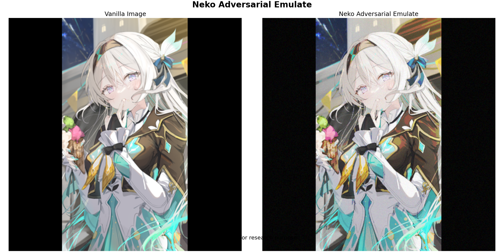

# Neko Adversarial Emulate

## Introduction

This project aims to emulate the workings of adversarial attacks but with a simpler and more cost-effective approach. The purpose is to understand and replicate the core concepts of adversarial attacks without the extensive computational requirements typically associated with such tasks.

## Comparison Plot

Below is the comparison plot generated by our script, illustrating the differences between the original ("Vanilla Image") and the adversarially emulated image ("Neko Adversarial Emulate").

